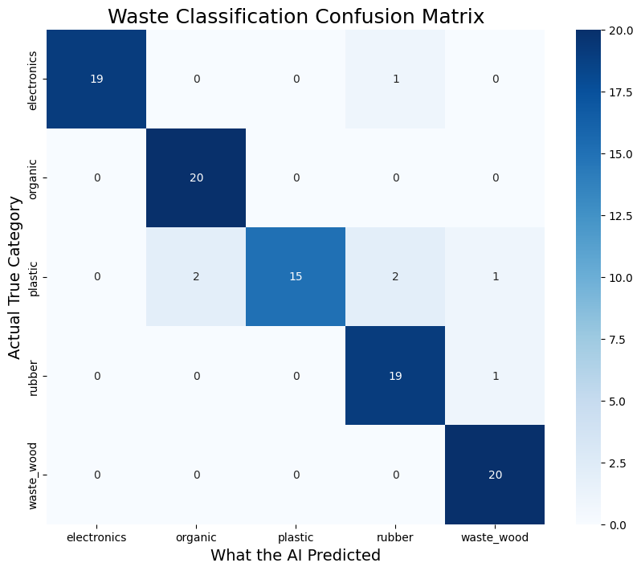
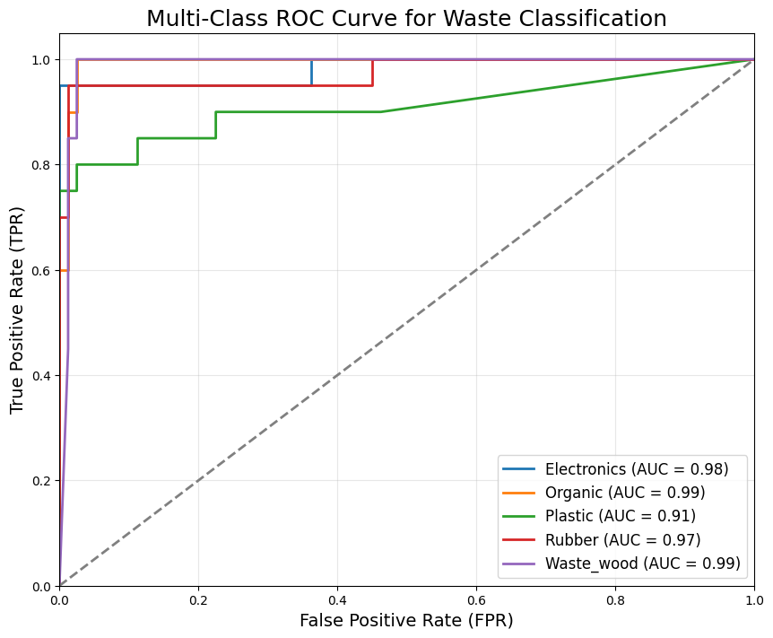

# ♻️ Solid Waste Classifier (MobileNetV2)

A deep learning-based waste classification system designed for real-world scenarios.

## 🔗 Live Demo
👉 https://krishnaHF1111-solid-waste-classifier.hf.space

---

## 🚀 Features
- Transfer Learning using MobileNetV2
- Trained on real-world images
- 5 categories: Electronics, Organic, Plastic, Rubber, Waste Wood
- ~93% accuracy
- Real-time prediction via web app

---

## 🧠 Model Architecture
- MobileNetV2 (ImageNet pretrained)
- GlobalAveragePooling2D
- Dropout (0.4)
- Dense (Softmax)

---

## 📊 Results

### Confusion Matrix

### ROC Curve

---

## ⚙️ Run Locally

pip install -r requirements.txt  
python app.py

---

## 📌 Key Idea
Trained on real-world images instead of clean background datasets.

---

## 👨‍💻 Author
Krishna Pratap Singh ❤️
